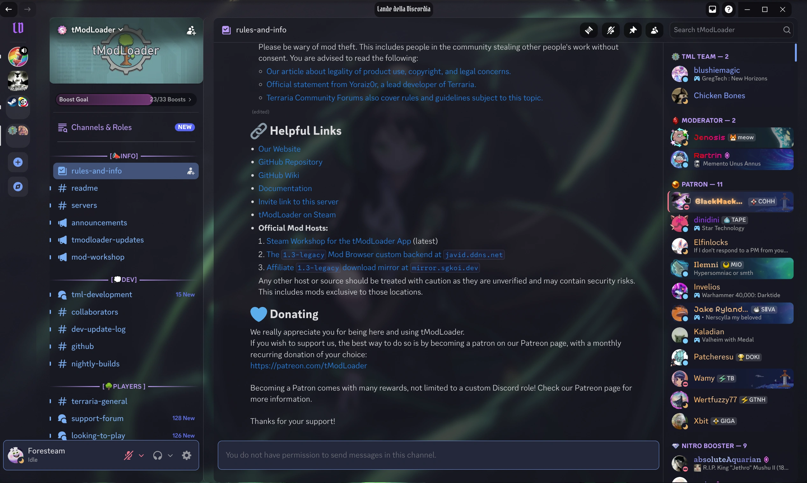

# Tokyo Night transparent Theme for Discord

_screenshot from [latest](https://github.com/Foresteam/DiscordTokyoNightTransparent/releases/latest) release_

A custom theme to enhance your Discord experience.

## About the Theme

This is a "Lande della Discordia" theme by [@ungiglio](https://discord.com/users/769144538107215872), with Tokyo Night (Noctalia) color palette.

And is it actually transparent, so you can see other apps below (or the wallpaper in this case).

## Before installing...

The steps below are for Linux, they work for my Niri install, and worked for KDE (KvantumManager). The _tricky_ part here is **transparency** and **blur**.

To enable transparency you need a Discord client/plugin capable of that, a compositor, or both. So my <u>Linux</u> setup is:

1. GoofCord for enabling transparency + theming (Vencord)
2. Niri for blur (KDE + Kvantum will also do)

For <u>Windows</u> you can try tutorials such as [this one](https://www.debugboard.org/blog/discord-transparency-guide) (not affiliated with me, just first link on the search).

## Installation: GoofCord (Vencord)

To install the theme:

1. Open your GoofCord client
2. Navigate to Vencord -> Themes
   - Either:
     1. Download the theme files from this GitHub repository _[see [links](#links) section below]_
     2. Under "Local Themes", click upload and select "discordia.theme.css"
   - Or: paste the URL in "Online themes" tab (this would always use the latest version): https://raw.githubusercontent.com/Foresteam/DiscordTokyoNightTransparent/refs/heads/main/discordia.theme.css
3. Enable the theme
4. Go to settings -> GoofCord -> settings, then toggle "Window transparency" on under Appearance tab
5. Restart GoofCord

## Reporting Bugs

If you encounter any issues or have suggestions for improving "Lande della Discordia", please:

- Open an issue on the original author's (as all core styles currently refer there, i just override) [GitHub repository](https://github.com/ungiglio/DiscordDiscordia/issues)
- Or on mine [GitHub repository](https://github.com/Foresteam/DiscordTokyoNightTransparent/issues).

## Links

- [Download Theme](https://github.com/Foresteam/DiscordTokyoNightTransparent/releases/latest)
- [Support Server](https://discord.gg/DDaRdZwB4h)
- [Vencord](https://vencord.dev)

---

© 2026 Foresteam, ungiglio. All rights reserved.
